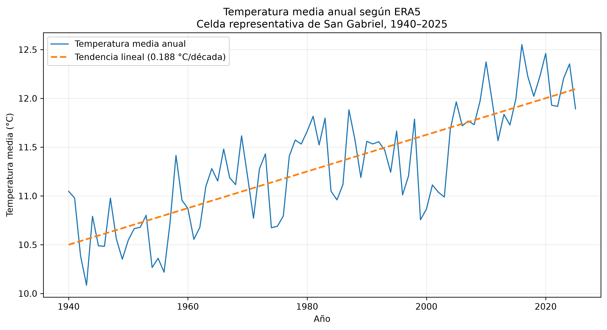
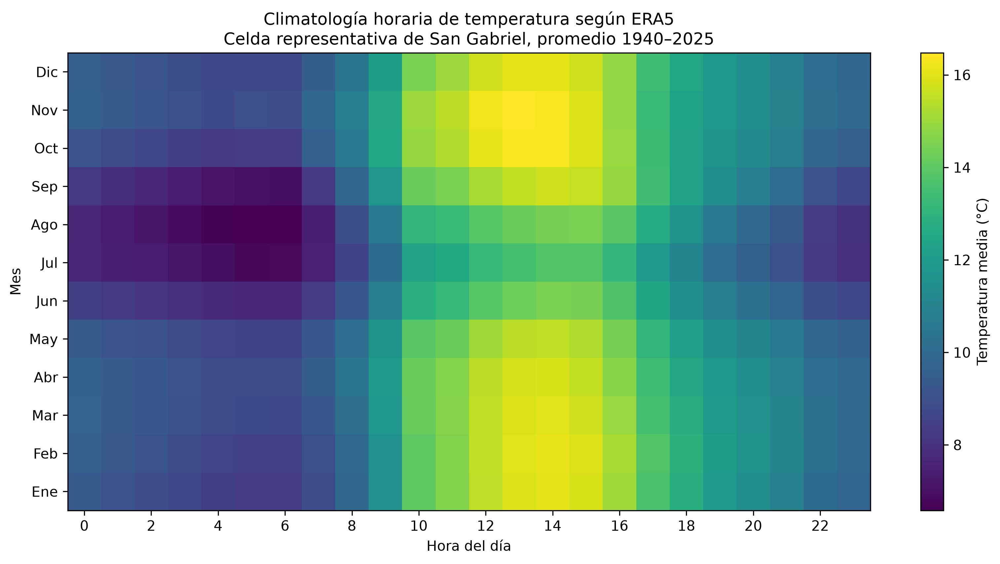
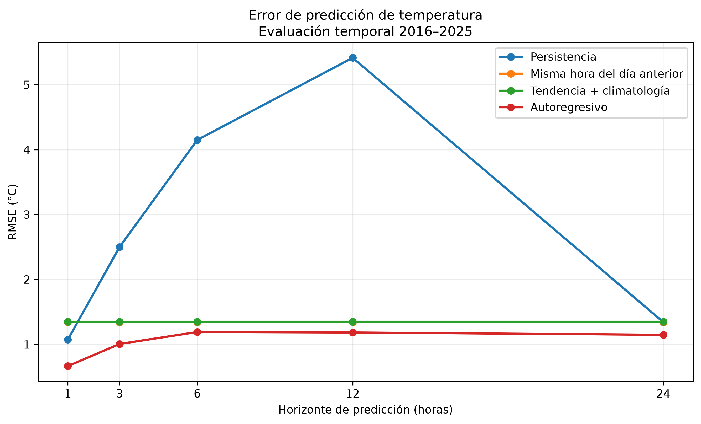
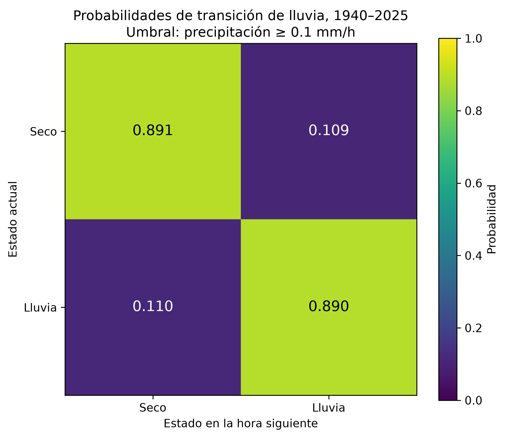
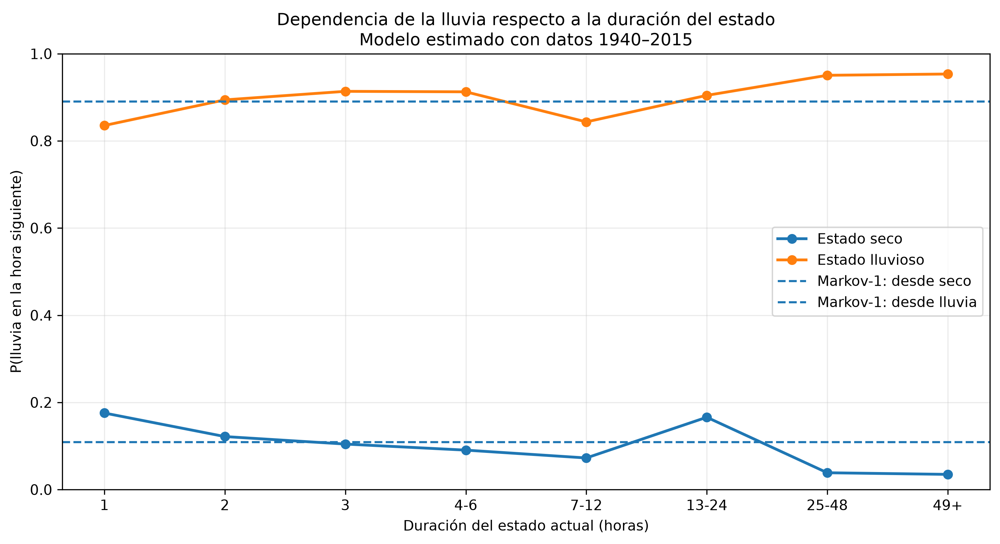

# Tarea 01 — Análisis meteorológico de San Gabriel con Open-Meteo

## Maestría en Ciencia de Datos — Universidad Yachay Tech

Este repositorio contiene el desarrollo de la **Tarea I: Contestando preguntas sobre los datos**, utilizando información meteorológica obtenida mediante la API histórica de Open-Meteo.

El estudio analiza una celda del reanálisis **ERA5 representativa de San Gabriel, cantón Montúfar, Ecuador**, entre 1940 y 2025.

El proyecto parte de la adquisición y auditoría de datos y continúa con análisis exploratorio, series temporales, modelos autoregresivos y modelos estocásticos para la ocurrencia de lluvia.

---

## Objetivo

El trabajo busca responder tres preguntas principales:

1. ¿Cómo ha evolucionado la temperatura representada por ERA5 para San Gabriel entre 1940 y 2025?
2. ¿Hasta qué punto puede predecirse la temperatura futura utilizando su estructura temporal?
3. ¿Qué tan persistentes son los estados secos y lluviosos, y cuánto aporta la memoria del proceso?

---

## Datos

Fuente:

- Open-Meteo Historical Weather API
- Modelo meteorológico: ERA5
- Resolución temporal: horaria
- Período: 1940-01-01 a 2025-12-31
- Registros: 753 888
- Zona horaria: America/Guayaquil

Coordenadas solicitadas:

- latitud: 0.59354
- longitud: -77.83066

Celda utilizada por ERA5:

- latitud: 0.5
- longitud: -77.75
- elevación reportada: 2856 m

Variables analizadas:

- temperatura del aire a 2 m (`temperature_2m`);
- humedad relativa a 2 m (`relative_humidity_2m`);
- precipitación horaria (`precipitation`).

ERA5 es un producto de reanálisis meteorológico. Por tanto, los valores no deben interpretarse como mediciones directas de una estación ubicada exactamente en San Gabriel.

---

# Resultados principales

## 1. Evolución histórica de la temperatura

La temperatura media de toda la serie fue aproximadamente:

**11.30 °C**

La tendencia lineal estimada fue aproximadamente:

**0.187 °C por década**

El año con menor temperatura media fue 1943, con aproximadamente 10.09 °C.

El año con mayor temperatura media fue 2016, con aproximadamente 12.55 °C.



La tendencia representa una descripción estadística de la serie ERA5 analizada. No constituye por sí sola una atribución causal ni una medición instrumental directa del cambio climático local.

---

## 2. Climatología horaria

La temperatura presenta una estructura periódica marcada asociada con la hora del día y el mes del año.



Esta estructura justificó separar conceptualmente la temperatura como:

`temperatura = tendencia + estacionalidad + residuo`

Incluso después de retirar tendencia y climatología, los residuos conservaron autocorrelación temporal.

Por ejemplo:

- autocorrelación residual a 1 hora: aproximadamente 0.828;
- autocorrelación residual a 24 horas: aproximadamente 0.522.

---

## 3. Predicción de temperatura

Se utilizó una división cronológica para evitar fuga de información:

- entrenamiento: 1940-2015;
- prueba: 2016-2025.

Se compararon cuatro estrategias:

- persistencia;
- misma hora del día anterior;
- tendencia + climatología;
- modelo autoregresivo.

Los horizontes evaluados fueron:

1, 3, 6, 12 y 24 horas.



El modelo autoregresivo obtuvo el menor RMSE en todos los horizontes analizados.

| Horizonte | RMSE autoregresivo |
|---:|---:|
| 1 h | 0.665 °C |
| 3 h | 1.007 °C |
| 6 h | 1.191 °C |
| 12 h | 1.183 °C |
| 24 h | 1.148 °C |

A una hora, el modelo autoregresivo redujo de forma clara el error respecto a la persistencia.

---

## 4. Persistencia de estados secos y lluviosos

El menor valor positivo de precipitación encontrado en el dataset fue:

**0.1 mm/h**

Se definieron dos estados:

- seco: precipitación < 0.1 mm/h;
- lluvia: precipitación >= 0.1 mm/h.

Para una cadena de Markov de primer orden se estimó aproximadamente:

`P(lluvia siguiente | seco) = 0.109`

`P(lluvia siguiente | lluvia) = 0.890`



Esto muestra una fuerte persistencia temporal.

Una hora lluviosa contiene mucha más información sobre la hora siguiente que un modelo que ignore el estado actual.

---

## 5. ¿Es suficiente un modelo de Markov de primer orden?

También se investigó si la duración acumulada del estado actual aporta información adicional.



En el conjunto de prueba 2016-2025 se obtuvieron aproximadamente:

| Modelo | Brier Score | Log Loss |
|---|---:|---:|
| Sin memoria | 0.2500 | 0.6932 |
| Markov orden 1 | 0.0984 | 0.3480 |
| Markov orden 2 | 0.0979 | 0.3455 |
| Dependiente de duración | 0.0968 | 0.3392 |

El modelo dependiente de duración mejoró el Brier Score alrededor de **1.7 %** respecto a Markov de primer orden.

La mejora indica que la duración del episodio contiene información adicional, aunque el modelo Markoviano de primer orden ya captura gran parte de la estructura predictiva.

---

# Metodología

La secuencia general del proyecto fue:

```text
Open-Meteo API
      ↓
86 archivos ERA5 anuales
      ↓
Auditoría automática
      ↓
Dataset maestro
      ↓
Análisis exploratorio
      ↓
Diagnóstico temporal
      ↓
Modelos autoregresivos y estocásticos
      ↓
Evaluación temporal
      ↓
Cinco figuras finales
```

La metodología detallada se encuentra en:

`docs/methodology.md`

Las preguntas de investigación se encuentran en:

`docs/research_questions.md`

---

# Auditoría de los datos

Se verificaron automáticamente los 86 años de información.

Las comprobaciones incluyeron:

- continuidad horaria;
- timestamps duplicados;
- valores faltantes;
- rangos básicos de validez;
- unidades;
- zona horaria;
- coordenadas;
- consistencia de metadatos.

Todos los años superaron la auditoría.

El dataset maestro contiene exactamente **753 888 registros horarios**, desde `1940-01-01T00:00` hasta `2025-12-31T23:00`.

La huella SHA-256 del dataset maestro es:

`8e46e53cd1d47057cd65f86ef9bc7a256a9192a308cf2f5ff506ac34c3a30cc8`

---

# Estructura del repositorio

```text
Tarea 1/
│
├── data/
│   ├── raw/
│   ├── processed/
│   └── analysis/
│
├── docs/
│   ├── methodology.md
│   └── research_questions.md
│
├── figures/
│   ├── 01_temperatura_anual_tendencia.png
│   ├── 02_climatologia_mes_hora.png
│   ├── 03_rmse_horizonte_prediccion.png
│   ├── 04_matriz_transicion_lluvia.png
│   └── 05_probabilidad_lluvia_duracion.png
│
├── src/
│   ├── audit_archive.py
│   ├── build_master_dataset.py
│   ├── profile_dataset.py
│   ├── stochastic_diagnostics.py
│   ├── compare_models.py
│   ├── horizon_duration_diagnostics.py
│   ├── compare_rain_state_models.py
│   └── generate_figures.py
│
├── requirements.txt
└── README.md
```

---

# Instalación

El proyecto fue desarrollado utilizando Python 3.13.

Crear el entorno virtual:

```powershell
python -m venv .venv
```

Instalar las dependencias:

```powershell
.\.venv\Scripts\python.exe -m pip install -r requirements.txt
```

Las principales dependencias son NumPy, Pandas y Matplotlib.

---

# Reproducción del análisis

Descargar y auditar ERA5:

```powershell
.\.venv\Scripts\python.exe src/audit_archive.py --start-year 1940 --end-year 2025
```

Construir el dataset maestro:

```powershell
.\.venv\Scripts\python.exe src/build_master_dataset.py
```

Ejecutar el análisis exploratorio:

```powershell
.\.venv\Scripts\python.exe src/profile_dataset.py
```

Ejecutar los diagnósticos estocásticos:

```powershell
.\.venv\Scripts\python.exe src/stochastic_diagnostics.py
```

Comparar modelos predictivos:

```powershell
.\.venv\Scripts\python.exe src/compare_models.py
```

Analizar horizontes y duración:

```powershell
.\.venv\Scripts\python.exe src/horizon_duration_diagnostics.py
```

Comparar modelos de lluvia:

```powershell
.\.venv\Scripts\python.exe src/compare_rain_state_models.py
```

Generar las cinco figuras finales:

```powershell
.\.venv\Scripts\python.exe src/generate_figures.py
```

---

# Decisiones metodológicas

El proyecto priorizó reproducibilidad, integridad de los datos, separación temporal entre entrenamiento y prueba, interpretabilidad y comparación contra modelos simples.

No se incorporó una red neuronal únicamente para aumentar la complejidad.

Los resultados mostraron que modelos autoregresivos y estocásticos relativamente sencillos permiten describir y predecir una parte importante de la estructura temporal presente en los datos.

---

# Limitaciones

Los principales límites del análisis son:

1. ERA5 es un producto de reanálisis meteorológico y no una estación local.
2. Los resultados corresponden a una celda representativa del área de San Gabriel.
3. Una tendencia estadística observada no implica por sí sola causalidad.
4. La evaluación predictiva principal se realizó entre 2016 y 2025.
5. Parte del análisis de precipitación transforma una variable continua en estados seco/lluvia.
6. No se realizó una validación independiente con observaciones de una estación meteorológica local.

---

# Conclusiones

El análisis de 86 años de información ERA5 permitió identificar estructuras temporales claras en temperatura y precipitación.

La temperatura presenta tendencia de largo plazo, estacionalidad horaria y mensual y una marcada dependencia temporal.

El modelo autoregresivo superó a los métodos ingenuos en todos los horizontes estudiados entre 1 y 24 horas.

La precipitación mostró una fuerte persistencia de estados.

Una cadena de Markov de primer orden captura gran parte de esta dinámica, mientras que incorporar la duración del estado produce una mejora adicional pequeña pero medible.

En conjunto, el proyecto muestra que una API meteorológica puede utilizarse no solo para obtener y visualizar datos, sino también para estudiar tendencias, estacionalidad, dependencia temporal, predictibilidad y procesos estocásticos de manera reproducible.

<!-- EXPOSICION_START -->

# Guion para la exposición

## 1. Pregunta central

Este proyecto analiza una serie climática horaria ERA5 para una celda
representativa de San Gabriel durante **1940-2025**.

Se dispone de **753 888 observaciones horarias**.

Las variables principales son:

- temperatura a 2 metros;
- humedad relativa;
- precipitación.

La pregunta central es:

> ¿Qué patrones y qué memoria temporal existen en las variables
> climáticas y cuánto ayudan a predecir su comportamiento futuro?

---

## 2. División temporal

La evaluación respeta estrictamente el orden temporal:

- **Entrenamiento:** 1940-2015.
- **Prueba:** 2016-2025.

Así se evita utilizar información futura durante el entrenamiento.

La evaluación predictiva de AR y SARIMA se realiza a **un paso adelante**:
para predecir cada hora se permite utilizar la historia observada hasta la
hora inmediatamente anterior. Por tanto, los resultados representan
predicción horaria condicionada a información pasada disponible y no un
pronóstico recursivo libre de diez años.

---

## 3. Temperatura

La temperatura se estudia mediante la idea:

```text
TEMPERATURA
    |
    +--- tendencia
    |
    +--- climatología mes-hora
    |
    +--- residuo
            |
            +--- dependencia temporal
```

Primero se retiran la tendencia y la climatología mes-hora.

Después se modela la memoria que permanece en los residuos.

Los modelos se comparan progresivamente:

```text
Persistencia
     |
     v
Determinista
     |
     v
AR
     |
     v
SARIMA
```

---

## 4. Modelo SARIMA

El nuevo modelo es:

```text
SARIMA(2,0,1) x (1,0,1,24)
```

El periodo estacional **24** representa el ciclo diario de una
serie horaria.

SARIMA se aplica sobre los residuos después de retirar previamente
la tendencia y la climatología mes-hora.

Por eso utilizamos:

```text
d = 0
D = 0
```

La pregunta es si todavía queda una dependencia periódica que el
modelo AR no capture completamente.

---

## 5. Resultados

Evaluación sobre el periodo **2016-2025**:

| Modelo | MAE | RMSE | R² |
|---|---:|---:|---:|
| Persistencia | 0.7508 | 1.0732 | 0.8768 |
| Determinista | 1.0586 | 1.3486 | 0.8055 |
| AR | 0.4925 | 0.6653 | 0.9527 |
| **SARIMA** | **0.4581** | **0.6229** | **0.9585** |

Para SARIMA:

```text
MAE  = 0.4581 °C
RMSE = 0.6229 °C
R²   = 0.9585
```

Frente al AR:

```text
reducción MAE  = 6.98 %
reducción RMSE = 6.37 %
```

El AR ya explica una gran parte de la dependencia temporal.

SARIMA consigue una mejora adicional al representar explícitamente
estructura periódica residual asociada al ciclo de 24 horas.

Por tanto:

> **La mayor parte de la memoria de corto plazo puede modelarse con AR,
> pero existe información temporal adicional que SARIMA puede aprovechar.**

---

## 6. Precipitación

La precipitación se estudia como un sistema discreto:

```text
SECO <------> LLUVIA
```

La complejidad aumenta progresivamente:

```text
Probabilidad global
        |
        v
Markov orden 1
        |
        v
Markov orden 2
        |
        v
Duración del episodio
```

La pregunta es si la probabilidad futura de lluvia depende únicamente
del estado actual o también de la historia reciente.

---

## 7. La conexión entre SARIMA y Markov

Aunque los modelos son diferentes, todos estudian **memoria temporal**:

```text
                 MEMORIA TEMPORAL
                       |
            +----------+----------+
            |                     |
            v                     v
       TEMPERATURA           PRECIPITACIÓN
            |                     |
            v                     v
    variable continua       estados discretos
            |                     |
            v                     v
       AR / SARIMA              MARKOV
```

AR y SARIMA modelan dependencia temporal sobre una variable continua.

Markov modela dependencia temporal sobre estados discretos.

---

## 8. Idea central del trabajo

```text
DATOS
  |
  v
PATRONES
  |
  v
TENDENCIA Y ESTACIONALIDAD
  |
  v
DEPENDENCIA TEMPORAL
  |
  v
MEMORIA
  |
  v
PREDICCIÓN
```

El objetivo no fue escoger automáticamente el modelo más complejo.

La estrategia fue aumentar progresivamente la complejidad y comprobar
si cada nuevo componente aporta información predictiva.

---

## 9. Mensaje final para la exposición

Para temperatura:

```text
Determinista -> AR -> SARIMA
```

Para precipitación:

```text
Probabilidad -> Markov 1 -> Markov 2 -> Duración
```

La idea que conecta todo el proyecto es:

> **Los patrones describen el comportamiento climático; la memoria
> temporal permite convertir esos patrones en información predictiva.**

---

## 10. Reproducción desde VS Code

Desde la raíz del proyecto:

```powershell
.\\.venv\\Scripts\\python.exe src\compare_models.py
.\\.venv\\Scripts\\python.exe src\horizon_duration_diagnostics.py
.\\.venv\\Scripts\\python.exe src\compare_rain_state_models.py
.\\.venv\\Scripts\\python.exe src\compare_sarima.py
.\\.venv\\Scripts\\python.exe src\generate_figures.py
```

<!-- EXPOSICION_END -->
